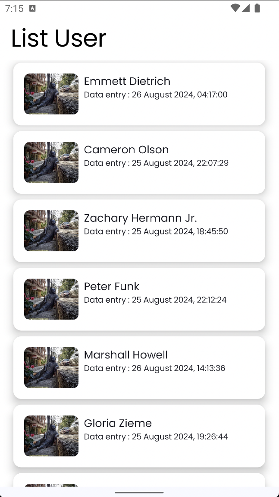
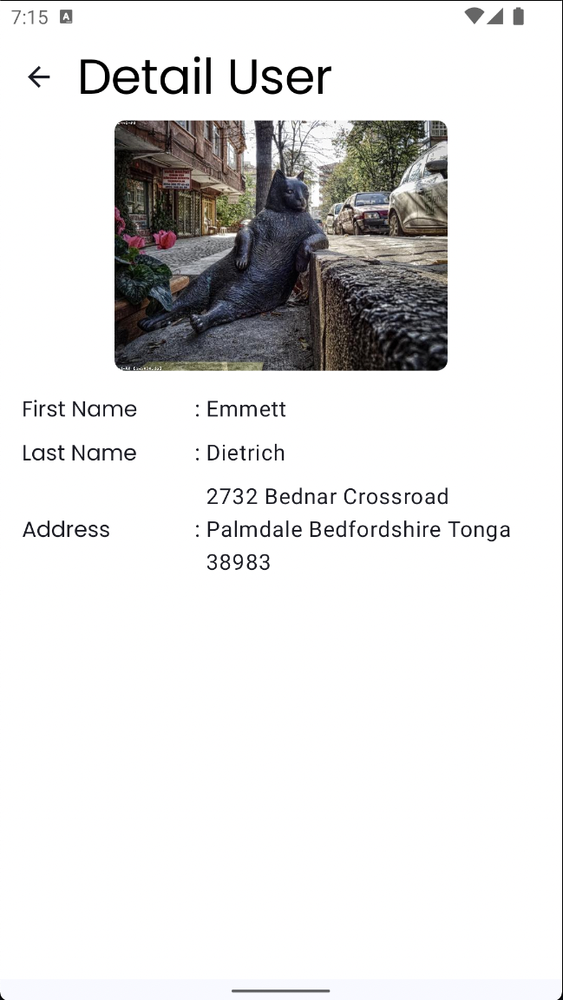

# Simple Clean Architecture MVVM with Jetpack Compose & Hilt

[](LICENSE)




This project demonstrates the implementation of a simple Android app using Clean Architecture, MVVM, Jetpack Compose, and Dagger Hilt for dependency injection. It is organized into multiple modules (`app`, `common`, `network`) to showcase multi-module architecture.

## Features

- **Clean Architecture**: Structured to follow Clean Architecture principles for separation of concerns.
- **MVVM**: Model-View-ViewModel architecture for better maintainability and testability.
- **Jetpack Compose**: A modern Android UI toolkit for building native UIs.
- **Dagger Hilt**: Dependency injection framework to manage dependencies.
- **Retrofit**: Networking library for handling HTTP requests.
- **Unit Tests**: Unit tests using **Mockito** for mocking and **Turbine** for testing flows.
- **Multi-Module**: Organized into multiple modules (`app`, `common`, `network`) for a more scalable and maintainable project structure.

## Architecture

**Clean Architecture** is a software design approach that promotes separation of concerns, making the codebase modular, testable, and maintainable. It divides the code into distinct layers:

1. **Presentation Layer**: Handles the UI and user interaction.
2. **Domain Layer**: Contains the business logic and use cases.
3. **Data Layer**: Manages data sources (e.g., APIs, local databases) and repositories.

This separation ensures that each layer has a single responsibility and can be developed and tested independently.

### MVVM Design Pattern
**MVVM (Model-View-ViewModel)** is a design pattern used in conjunction with Clean Architecture. It consists of:

- **Model**: Represents the data and business logic.
- **View**: The UI layer that displays data and handles user interaction.
- **ViewModel**: Acts as a bridge between the View and Model, providing data for the UI and handling user actions.

MVVM ensures that the UI is decoupled from the underlying logic, making it easier to update and test.


## Dependencies

- **Jetpack Compose**
- **Dagger Hilt**
- **Retrofit**
- **Mockito**
- **Turbine**

## Installation

To run this project locally:

1. Clone the repository:
   ```bash
   git clone https://github.com/Lucgudev/Simple-Clean-Architecture-MVVM-Jetpack-Compose-Hilt.git
    ```
2. Open the project in Android Studio.

3. Make sure your Android SDK is up-to-date and the required dependencies are installed.

4. Sync Gradle to ensure all dependencies are resolved.

5. Build and run the project on your preferred Android device or emulator.

## Project Structure
The project is organized into the following modules:
```bash
.
├── app                    # The main app module
├── common                 # Shared code and utilities
├── network                # Network-related code, Retrofit, and Dagger Hilt modules
└── README.md
```

- ```app```: Contains the Android application-specific code, including the main `Activity` and UI logic.
- ```common```: Contains shared utilities, models, and base classes used across other modules.
- ```network```: Contains networking logic, including Retrofit and related components.

## Unit Testing

The project includes unit tests for various components, primarily focusing on ViewModel logic. The following testing frameworks are used:

- Mockito: For mocking dependencies in unit tests.
- Turbine: For testing Kotlin Flows and asynchronous operations in unit tests.

To run the unit tests:

1. Open the Test tab in Android Studio.
2. Select the test class or individual test case you want to run.
3. Click the "Run" button to execute the tests.

## Notes
- No UseCases: This project does not include the use case layer because no use case logic was required for the project. The business logic resides directly in the ViewModel.
- Multi-Module: The project uses a multi-module architecture, which helps in separating concerns and maintaining modular, reusable code.
- State Management: The app uses a simple State and Event model for ViewModel-based state management.


## License
This project is licensed under the MIT License - see the LICENSE file for details.

